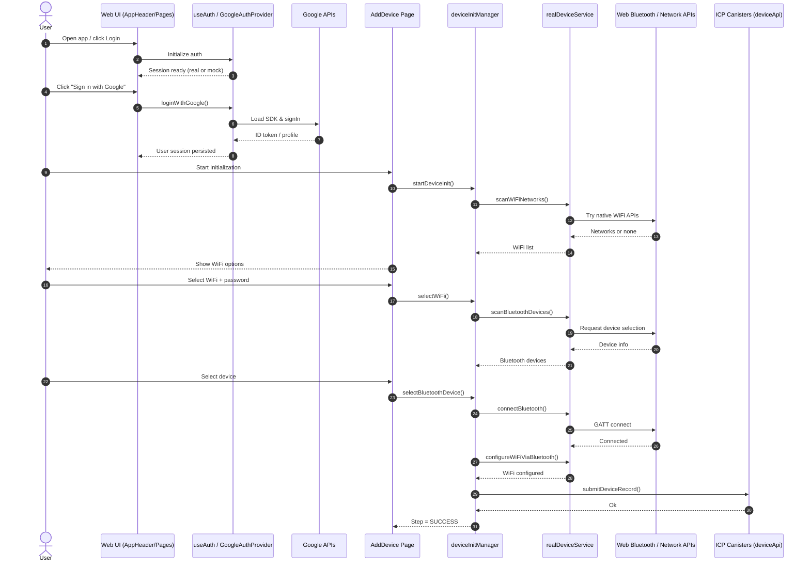

# AIO-2030: Super AI Decentralized Network

A comprehensive decentralized AI ecosystem built on Internet Computer Protocol (ICP) that fundamentally reconstructs the AI interaction paradigm through blockchain technology and agent collaboration networks.

## V0.1 Demo Deployed canisters
URLs:
  Frontend canister via browser
    aio-base-frontend: https://scswk-paaaa-aaaau-abyaq-cai.icp0.io/
  Backend canister via Candid interface:
    aio-base-backend: https://a4gq6-oaaaa-aaaab-qaa4q-cai.raw.icp0.io/?id=sftq6-cyaaa-aaaau-abyaa-cai


## Table of Contents

- [Overview](#overview)
- [Architecture](#architecture)
- [Core Components](#core-components)
- [Project Structure](#project-structure)
- [Tech Stack](#tech-stack)
- [Token Economy](#token-economy)
- [AIO Protocol Stack](#aio-protocol-stack)
- [Quick Start](#quick-start)
- [API Reference](#api-reference)
- [Development](#development)
- [Security Features](#security-features)
- [Contributing](#contributing)
- [License](#license)

## What's New (Recent Updates)

The following improvements were implemented across the Chat Nexus frontend and shared components:

- Navigation and Header
  - Bottom navigation: renamed `Profile` to `AI`, changed the icon to Sparkles, and made it point to the home (`/`).
  - Introduced a reusable `AppHeader` that unifies avatar click-to-profile, login/logout, and layout across pages.
  - Avatar click (mobile and desktop) navigates to `/profile` consistently.

- Authentication (Google OAuth)
  - Added a dedicated hook `useGoogleAuth` that encapsulates all Google OAuth logic with safe fallbacks.
  - Added `GoogleAuthProvider` which lazy-loads Google API, initializes auth, and allows the app to continue with a mock fallback if misconfigured or blocked by CSP.
  - Updated `useAuth` to integrate Google login/logout, status validation, and session sync.
  - Switched env keys to Vite conventions: `VITE_GOOGLE_CLIENT_ID`, `VITE_API_URL`, `VITE_ENVIRONMENT`.
  - Updated CSP (`.ic-assets.json5`) to allow Google APIs/images: `apis.google.com`, `accounts.google.com`, `www.googleapis.com`, `lh3.googleusercontent.com`.

- Layout and Content Visibility
  - Fixed content being obscured by the bottom nav on mobile by applying responsive `calc(100vh - header - nav)` height rules.
  - Adjusted `ChatBox` and page containers (`Index.tsx`, etc.) to use `max-h`/`min-h-0` and reduced bottom margins on mobile.

- Wallet Section Scope
  - Removed the inline "My Wallet" cards from `Index.tsx`, `Contracts.tsx`, `MyDevices.tsx`, and `Shop.tsx`.
  - Kept the wallet section exclusively on `Profile.tsx` per product requirements.

- Device Initialization Flow (Add Device)
  - Improved responsive layout and scroll handling so the main area is not covered by the bottom nav.
  - Added WiFi password dialog (show/hide, Enter-to-submit) before proceeding to Bluetooth scan.
  - Implemented `realDeviceService` which attempts real WiFi/Bluetooth discovery via web APIs with graceful fallbacks:
    - WiFi: tries experimental Web WiFi / Network Information APIs; falls back to realistic mock data.
    - Bluetooth: uses Web Bluetooth API for selection and GATT connection; falls back to realistic mock data.
  - Switched `deviceInitManager` from `deviceService` (mock) to `realDeviceService` for scanning, connecting, configuring, and submitting device records.

> Note: Real WiFi enumeration is restricted in most browsers. The implementation attempts all available web APIs and falls back to simulated data when unsupported. Web Bluetooth requires a supported browser (e.g., Chrome) and HTTPS context.

### Environment Configuration (Vite)

- Create `.env` and set at least:

```
VITE_GOOGLE_CLIENT_ID=your_google_client_id
VITE_API_URL=http://localhost:3000
VITE_ENVIRONMENT=development
```

### CSP for ICP Hosting

If you host on ICP with `.ic-assets.json5`, ensure the following directives include Google endpoints:

- `script-src`: `https://apis.google.com https://accounts.google.com`
- `connect-src`: `https://accounts.google.com https://www.googleapis.com`
- `img-src`: `https://lh3.googleusercontent.com`

### Usage Tips

- Avatar in the header navigates to `/profile`.
- Bottom nav `AI` goes to the home chat.
- Add Device flow: WiFi scan → password dialog → Bluetooth scan → connection and WiFi provisioning.


## Overview

**AIO-2030 (Super AI Decentralized Network)** introduces the *De-Super Agentic AI Network*, featuring:

- Contract-based agent registration framework
- On-chain task traceability and incentive mechanisms
- Decentralized AI agent collaboration network
- Advanced blockchain-based backend services
- Multi-chain protocol (MCP) operations
- Comprehensive token economy with staking and rewards
- Distributed computing infrastructure

### What Makes AIO-2030 Unique

- **True Decentralization**: Built on Internet Computer (ICP) for user-friendly Web 3.0 experience
- **Agent Orchestration**: Queen Agent serves as superintelligence orchestrator
- **Multi-Chain Support**: Standardized protocols for cross-chain AI operations
- **Token Economy**: $AIO token with staking, rewards, and governance mechanisms
- **Open Ecosystem**: Composable AI Agent collaboration network

## Architecture

### System Architecture

```
┌─────────────────┐    ┌─────────────────┐    ┌─────────────────┐
│   Frontend      │    │   Backend       │    │   AIO Pod       │
│   (React/TS)    │◄──►│   (Rust/ICP)    │◄──►│   (Python)      │
│                 │    │                 │    │                 │
│ • User Interface│    │ • Smart Contract│    │ • MCP Execution │
│ • Agent Store   │    │ • Token Economy │    │ • Task Runtime  │
│ • Chat System   │    │ • Trace Logging │    │ • File Handling │
└─────────────────┘    └─────────────────┘    └─────────────────┘
         │                       │                       │
         └───────────────────────┼───────────────────────┘
                                 │
         ┌───────────────────────▼───────────────────────┐
         │              Queen Agent                      │
         │        (Intelligence Orchestrator)            │
         │                                               │
         │ • Intent Analysis  • Task Decomposition       │
         │ • Agent Selection  • Quality Control          │
         │ • Plan Generation  • Ecosystem Integration    │
         └───────────────────────────────────────────────┘
```

### Data Flow

```
User Request → Intent Analysis → Task Decomposition → Agent Selection → Execution → Quality Control → Response
                     ↓                    ↓                  ↓             ↓              ↓
            Trace Logging → Work Ledger → Token Economy → Mining Rewards → Audit Trail
```

### Component Interaction Sequence



### Dapp Architecture (Detailed)

This dapp is composed of three cooperating planes. Each plane is independently testable, deployable, and replaceable.

1) Interaction Plane (Web Frontend)
- Tech: React + TypeScript (Vite), shadcn/ui, Radix, Tailwind
- State: React Context + TanStack Query (server/cache), localStorage for sessions
- Responsibilities:
  - Routing, layout, and client-side rendering
  - Authentication (Wallet / Google OAuth)
  - AI chat UX, agent orchestration UI, device initialization UX
  - Calls dapp APIs (ICP canisters, AIO Pod, external providers)

2) Coordination & Ledger Plane (ICP Canisters)
- Tech: Rust (canister smart contracts)
- Responsibilities:
  - Token economy (credits/AIO), staking, grants, ledger updates
  - Agent/MCP metadata, capability registry, work-ledger, traces
  - Contract-based agent registration and governance
  - Candid interfaces provide stable API contracts

3) Execution Plane (AIO Pod / External Services)
- Tech: Python VM, isolated subprocesses, REST API
- Responsibilities:
  - MCP execution, long-running tasks, tool/agent integration
  - File handling and permissions, streaming outputs (SSE/stdio)
  - Bridges to third‑party AI services where appropriate

Cross-Cutting Concerns
- Observability: Trace IDs across UI → Canisters → AIO Pod
- Security: CSP, strict origin policies, permission prompts (Bluetooth), defensive parsing
- Compatibility: Graceful feature detection (e.g., Web Bluetooth), mock fallbacks in non-supported browsers

Runtime View
- Browser loads web app → `AppHeader` and bottom nav render → routes load feature modules
- Auth initializes early (GoogleAuthProvider), wallet available via Plug integration
- Feature flows (e.g., Add Device) call `deviceInitManager`, which delegates to `realDeviceService` (web APIs) or safely falls back

Deployment View
- Frontend built via Vite → deployed as ICP asset canister (or static host)
- Canisters deployed via DFX (local/dev/prod networks)
- AIO Pod runs as a separately managed service; endpoints configured via env

### Technical Capability Specification

This section standardizes the functional and non‑functional capabilities exposed by the dapp.

1) Functional Capabilities
- Authentication
  - Google OAuth 2.0 via `useGoogleAuth` + `GoogleAuthProvider`
  - Wallet connect (Plug) with session persistence
  - Requirements: `VITE_GOOGLE_CLIENT_ID`, CSP allowances for Google endpoints
- AI Chat & Agent UI
  - Chat container with message virtualization, tool outputs, and rich responses
  - Prompt frameworks (intent/index/protocol adapters) in `src/.../config`
- Device Initialization
  - WiFi scan → password input → Bluetooth scan → GATT connect → WiFi provisioning → submit device record
  - Implemented in `services/realDeviceService.ts` and coordinated by `services/deviceInitManager.ts`
  - Progressive enhancement: uses Web APIs when available, falls back to realistic mock data otherwise
- Wallet Views
  - Wallet presentation restricted to `Profile` page for clarity

2) Non‑Functional Capabilities
- Performance: Vite bundling, lazy loading by routes/components where feasible; chunk size warnings monitored
- Security:
  - CSP enforced (ICP `.ic-assets.json5`) with explicit allow-lists for scripts/connect/img
  - OAuth tokens kept in memory and localStorage only where strictly required; errors sanitized
  - Web Bluetooth requests must originate from user gestures and HTTPS contexts
- Accessibility: Color contrast aware palettes; keyboard and screen‑reader friendly components from Radix/shadcn
- Internationalization: Copy structure designed for simple extraction (future i18n plumbing ready)

3) API Contracts (Selected)
- Device Services (`realDeviceService`)
  - `scanWiFiNetworks(): Promise<WiFiNetwork[]>`
    - Returns list with fields: `id,name,security,strength,frequency?,channel?`
  - `scanBluetoothDevices(): Promise<BluetoothDevice[]>`
    - Returns list with fields: `id,name,rssi,type,mac,paired?,connectable?`
  - `connectBluetooth(device)` → Promise<boolean>
  - `configureWiFiViaBluetooth(device, wifi, password?)` → Promise<boolean>
  - `getConnectionProgress()` → `Array<{progress:number,message:string}>`
  - All methods may throw `Error(message)`; callers must surface friendly UI
- Device Initialization Manager (`deviceInitManager`)
  - Steps: INIT → WIFI_SCAN → WIFI_SELECT → BLUETOOTH_SCAN → BLUETOOTH_SELECT → CONNECTING → SUCCESS
  - Methods: `startDeviceInit()`, `selectWiFi(wifi)`, `selectBluetoothDevice(device)`, `submitDeviceRecord()`
  - State mirrors steps, holds selections, progress, and last error

4) Data Models (simplified)
```ts
type WiFiNetwork = { id: string; name: string; security: string; strength: number; password?: string; frequency?: number; channel?: number };
type BluetoothDevice = { id: string; name: string; rssi: number; type: string; mac: string; paired?: boolean; connectable?: boolean };
type DeviceRecord = { name: string; type: string; macAddress: string; wifiNetwork: string; status: string; connectedAt: string };
```

5) Error Handling & UX Rules
- All async operations are wrapped with try/catch and surfaced through non‑blocking toasts or inline banners
- `GoogleAuthProvider` never blocks app render; when Google fails it shows a soft warning and falls back to mock auth
- Device flows show step progress and allow retry on recoverable errors

6) Environment & Feature Flags
- Required env (Vite):
  - `VITE_GOOGLE_CLIENT_ID`, `VITE_API_URL`, `VITE_ENVIRONMENT`
- Optional flags (future):
  - `VITE_ENABLE_WEB_BLUETOOTH`, `VITE_ENABLE_WIFI_SCAN`

7) Security & CSP Specification
- Example ICP `.ic-assets.json5` additions:
  - `script-src`: include `https://apis.google.com https://accounts.google.com`
  - `connect-src`: include `https://accounts.google.com https://www.googleapis.com`
  - `img-src`: include `https://lh3.googleusercontent.com`
- Never load third‑party scripts from untrusted origins; prefer first‑party hosting

8) Browser Support Matrix (guideline)
- Chrome (latest): Full (Web Bluetooth behind permissions; WiFi enumeration often limited)
- Edge (latest): Similar to Chrome
- Safari/Firefox: No Web Bluetooth; flows automatically fall back to mock implementations

9) Coding Standards (Frontend)
- TypeScript strictness, explicit types on exported APIs
- UI: shadcn/ui + Radix; Tailwind utility classes with semantic grouping
- State: avoid deep prop-drilling; prefer context or query cache
- Error messages: human‑readable and action‑oriented; never expose sensitive details

## Core Components

| **Component** | **Description** | **Technology** |
|---------------|-----------------|----------------|
| **User** | Initiates AI tasks through intent-based requests | React Frontend |
| **Developer** | Contributes agents and MCP servers to the ecosystem | Developer Portal |
| **Queen Agent** | Superintelligence orchestrator for capability discovery and execution | AI Coordination |
| **Arbiter** | Token-based operations governance via smart contracts | ICP Canisters |
| **AIO-MCP Server** | Generalized AI service nodes with standardized interfaces | Python/Rust |
| **Frontend** | React-based user interface with comprehensive features | TypeScript/React |
| **Backend** | Blockchain-based services for the entire ecosystem | Rust/ICP |
| **AIO Pod** | Execution environment for MCP servers and tasks | Python VM |

## Project Structure

```
alaya-network/
├── aio-pod/                    # AIO Pod Server Components (Python)
│   ├── uploads/mcp/           # MCP executable files storage
│   └── api/                   # REST API endpoints
├── src/
│   ├── aio-base-backend/      # Backend Services (Rust + ICP)
│   │   ├── src/
│   │   │   ├── agent_asset_types.rs     # Agent lifecycle management
│   │   │   ├── mcp_asset_types.rs       # Multi-Chain Protocol handling
│   │   │   ├── token_economy.rs         # Economic system implementation
│   │   │   ├── trace_storage.rs         # Execution tracking
│   │   │   ├── mining_reword.rs         # Reward distribution
│   │   │   └── stable_mem_storage.rs    # Persistent storage
│   │   └── aio-base-backend.did         # Candid interface definitions
│   ├── aio-base-frontend/     # Frontend Application (TypeScript + React)
│   │   ├── src/
│   │   │   ├── components/              # UI components
│   │   │   ├── routes/                  # Application routes
│   │   │   ├── services/                # API services
│   │   │   ├── hooks/                   # React hooks
│   │   │   ├── contexts/                # React contexts
│   │   │   ├── config/                  # Prompt configurations
│   │   │   └── runtime/                 # AIO Protocol runtime
│   │   └── public/                      # Static assets
│   ├── alaya-chat-nexus-frontend/  # Chat Nexus Frontend (TypeScript + React)
│   │   ├── src/
│   │   │   ├── components/          # UI components
│   │   │   ├── pages/               # Application pages
│   │   │   ├── services/            # API services
│   │   │   └── utils/               # Utility functions
│   │   └── public/                  # Static assets
│   └── alaya-chat-nexus-*/          # Other Chat Components
├── univoice-whisper-chat/     # Voice Chat Components
├── target/                    # Rust Build Output
├── certificates/              # Certificate Files
└── test_files/               # Test files and examples
```

## Tech Stack

### Frontend (React/TypeScript)
- **Framework**: React 18.3.1 + TypeScript
- **Build Tool**: Vite
- **UI Framework**: shadcn/ui + Radix UI + Tailwind CSS
- **State Management**: React Context + TanStack Query
- **Routing**: React Router DOM
- **Blockchain Integration**: Dfinity Agent
- **Additional Libraries**: axios, react-hook-form, zod, lucide-react, recharts

### Backend (Rust/ICP)
- **Language**: Rust (latest stable)
- **Platform**: Internet Computer Protocol (ICP)
- **Storage**: Stable Memory Storage
- **Architecture**: Smart Contracts (Canisters)
- **API**: Candid Interface Definition Language

### AIO Pod (Python)
- **Runtime**: Python VM Environment
- **API**: REST API with CORS support
- **File Handling**: Automated permission management
- **Execution**: Subprocess-based MCP execution

## Token Economy

### Tokenomics Overview
- **Total Supply**: 21,000,000,000,000,000 $AIO tokens (8 decimal precision)
- **Base Currency**: Credits (exchangeable with ICP)
- **Staking Requirements**: Agents and MCP servers must stake $AIO tokens
- **Reward Distribution**: Automated mining rewards every 5 minutes

### Economic Features
- **New User Grant**: 1,000 credits for new accounts
- **New MCP Grant**: 10,000 credits for MCP developers
- **Staking Bonuses**: Kappa multiplier for staked credits
- **ICP-Credit Exchange**: Dynamic conversion rates
- **Governance**: Community proposals and voting mechanisms

### Account Management
- Principal-based account system
- Token and credit balance tracking
- Staked credits with multiplier benefits
- Comprehensive transaction history
- Unclaimed rewards accumulation

## AIO Protocol Stack

The AIO Protocol is a multi-layered framework for standardized agentic AI service interaction:

### 1. Application Layer (Intent & Interaction Interface)
- Captures user goals and system-level prompts
- Structures requests into actionable tasks
- Multilingual intent recognition

### 2. Protocol Layer (Inter-Agent Communication)
- Extended JSON-RPC 2.0 standard
- Trace ID for multi-agent call chain tracking
- Standardized message formats

### 3. Transport Layer (Message Transmission)
- **stdio**: Standard input/output communication
- **HTTP**: RESTful API communication
- **SSE**: Server-Sent Events for real-time updates

### 4. Execution Layer (Runtime Abstraction)
- **AIO_POD**: Default for dynamic, isolated tasks
- **Wasm Modules**: For ICP Canister execution
- **Hosted APIs**: Third-party AI service integration

### 5. Coordination Layer (Orchestration & Trust)
- **Queen Agent**: Constructs execution chains and resolves intent
- **EndPoint Canister**: Smart contracts for metadata and capabilities
- **Capability Discovery**: Intelligent agent selection

### 6. Ledger Layer (On-Chain Execution & Settlement)
- Distributed ledger via ICP Canisters
- $AIO token reward distribution
- Validated workload compensation

## Quick Start

### Prerequisites

- **Rust**: 1.70+ for backend development
- **Node.js**: 18+ for frontend development  
- **DFX**: Internet Computer SDK
- **Python**: 3.8+ for AIO Pod operations

### Installation

1. **Clone the repository**
   ```bash
   git clone <repository-url>
   cd alaya-network
   ```

2. **Install dependencies**
   ```bash
   # Install frontend dependencies
   cd src/aio-base-frontend
   npm install
   cd ../..
   
   # Install DFX
   sh -ci "$(curl -fsSL https://internetcomputer.org/install.sh)"
   ```

### Development Environment

1. **Start local ICP replica**
   ```bash
   dfx start --background
   ```

2. **Build and deploy everything**
   ```bash
   ./build.sh
   ```

3. **Build AIO Chat components**
   ```bash
   ./build-aichat.sh
   ```

4. **Access the application**
   ```bash
   # Get frontend canister ID
   dfx canister id aio-base-frontend
   
   # Open in browser
   # http://localhost:4943?canisterId=<canister-id>
   ```

### Development Mode

```bash
# Frontend development server
cd src/aio-base-frontend
npm run dev

# Backend rebuild
cargo build --release --target wasm32-unknown-unknown

# AIO Pod server
cd aio-pod
python app.py
```

## API Reference

### Agent Management APIs

#### Basic Operations
```candid
// Get specific agent
get_agent_item(id: nat64) -> opt AgentItem

// Get all agents
get_all_agent_items() -> vec AgentItem

// Add new agent
add_agent_item(agent: AgentItem, principal_id: text) -> variant { Ok: nat64; Err: text }

// Update existing agent
update_agent_item(id: nat64, agent: AgentItem) -> variant { Ok; Err: text }
```

#### Advanced Queries
```candid
// Get user's agents
get_user_agent_items() -> vec AgentItem

// Paginated listing
get_agent_items_paginated(offset: nat64, limit: nat64) -> vec AgentItem

// Find by name
get_agent_item_by_name(name: text) -> opt AgentItem
```

### MCP Management APIs

#### Core Operations
```candid
// Get MCP by name
get_mcp_item(name: text) -> opt McpItem

// Register new MCP
add_mcp_item(mcp: McpItem, principal_id: text) -> variant { Ok: text; Err: text }

// Update MCP configuration
update_mcp_item(name: text, mcp: McpItem) -> variant { Ok; Err: text }

// Remove MCP
delete_mcp_item(name: text) -> variant { Ok; Err: text }
```

#### Staking System
```candid
// Stake credits to MCP
stack_credit(principal_id: text, mcp_name: text, amount: nat64) -> variant { Ok: AccountInfo; Err: text }

// Get staking records
get_mcp_stack_records_paginated(mcp_name: text, offset: nat64, limit: nat64) -> vec McpStackRecord
```

### Token Economy APIs

#### Account Management
```candid
// Create account
add_account(principal_id: text) -> variant { Ok: AccountInfo; Err: text }

// Get account info
get_account_info(principal_id: text) -> opt AccountInfo

// Get balance summary
get_balance_summary(principal_id: text) -> record { 
    total_count: nat64; 
    total_amount: nat64; 
    success_count: nat64; 
    unclaimed_balance: nat64 
}
```

#### Credit Operations
```candid
// Use credits
use_credit(principal_id: text, amount: nat64, service: text, metadata: opt text) -> variant { Ok: AccountInfo; Err: text }

// Unstake credits
unstack_credit(principal_id: text, amount: nat64) -> variant { Ok: AccountInfo; Err: text }
```

#### ICP-Credit Exchange
```candid
// Get exchange rate
get_credits_per_icp_api() -> nat64

// Simulate conversion
simulate_credit_from_icp_api(icp_amount: float64) -> nat64

// Execute conversion
recharge_and_convert_credits_api(icp_amount: float64) -> nat64
```

### AIO Pod APIs

#### MCP Execution
```http
POST /api/v1/mcp/{filename}
Content-Type: application/json

{
  "args": ["--option", "value"]
}
```

**Response:**
- `200`: Execution successful (returns stdout)
- `404`: File not found
- `403`: Permission denied
- `500`: Execution error (returns stderr)

### Trace and Monitoring APIs

#### Trace Management
```candid
// Record execution trace
record_trace_call(
    trace_id: text, 
    context_id: text, 
    protocol: text, 
    agent: text, 
    call_type: text, 
    method: text, 
    input: IOValue, 
    output: IOValue, 
    status: text, 
    error_message: opt text
) -> variant { Ok: null; Err: text }

// Get paginated traces
get_traces_paginated(offset: nat64, limit: nat64) -> vec TraceLog

// Get trace statistics
get_traces_statistics() -> record { 
    total_count: nat64; 
    success_count: nat64; 
    error_count: nat64 
}
```

## Development

### Backend Development (Rust/ICP)

```bash
# Build backend
cd src/aio-base-backend
cargo build --release --target wasm32-unknown-unknown

# Run tests
cargo test

# Deploy to local network
dfx deploy aio-base-backend
```

### Frontend Development (React/TypeScript)

```bash
# Development server
cd src/aio-base-frontend
npm run dev

# Build for production
npm run build

# Deploy to ICP
dfx deploy aio-base-frontend
```

### AIO Pod Development (Python)

```bash
# Start AIO Pod server
cd aio-pod
python app.py

# Upload MCP file
curl -X POST http://localhost:5000/api/v1/mcp/upload \
  -F "file=@mcp_executable.bin"

# Execute MCP
curl -X POST http://localhost:5000/api/v1/mcp/mcp_voice \
  -H "Content-Type: application/json" \
  -d '{"args": ["--help"]}'
```

## Security Features

### Authentication & Authorization
- **Principal-based Authentication**: All operations verified against caller identity
- **Owner Verification**: Asset modifications restricted to owners
- **Role-based Access Control**: Different permissions for users, developers, and administrators

### Data Protection
- **Trace Auditing**: Complete operation logging for transparency
- **Stable Storage**: Crash-resistant data persistence
- **Input Validation**: Comprehensive parameter validation
- **Error Handling**: Secure error reporting without information leakage

### Smart Contract Security
- **Canister Security**: Following ICP security best practices
- **Token Security**: Protected token operations and transfers
- **Upgrade Security**: Controlled canister upgrade mechanisms

## Contributing

We welcome contributions to the AIO-2030 ecosystem! Please follow these guidelines:

### Development Process
1. Fork the repository
2. Create a feature branch (`git checkout -b feature/amazing-feature`)
3. Make your changes with comprehensive tests
4. Commit your changes (`git commit -m 'Add amazing feature'`)
5. Push to the branch (`git push origin feature/amazing-feature`)
6. Submit a pull request with detailed description

### Code Standards
- **Rust**: Follow rustfmt and clippy recommendations
- **TypeScript**: Use ESLint and Prettier configurations
- **Python**: Follow PEP 8 style guidelines
- **Documentation**: Update relevant README files and inline comments

### Testing Requirements
- Unit tests for all new functions
- Integration tests for API endpoints
- Frontend component tests
- End-to-end testing for critical flows

## License

MIT License

Copyright (c) 2024 AIO-2030 Project

Permission is hereby granted, free of charge, to any person obtaining a copy
of this software and associated documentation files (the "Software"), to deal
in the Software without restriction, including without limitation the rights
to use, copy, modify, merge, publish, distribute, sublicense, and/or sell
copies of the Software, and to permit persons to whom the Software is
furnished to do so, subject to the following conditions:

The above copyright notice and this permission notice shall be included in all
copies or substantial portions of the Software.

THE SOFTWARE IS PROVIDED "AS IS", WITHOUT WARRANTY OF ANY KIND, EXPRESS OR
IMPLIED, INCLUDING BUT NOT LIMITED TO THE WARRANTIES OF MERCHANTABILITY,
FITNESS FOR A PARTICULAR PURPOSE AND NONINFRINGEMENT. IN NO EVENT SHALL THE
AUTHORS OR COPYRIGHT HOLDERS BE LIABLE FOR ANY CLAIM, DAMAGES OR OTHER
LIABILITY, WHETHER IN AN ACTION OF CONTRACT, TORT OR OTHERWISE, ARISING FROM,
OUT OF OR IN CONNECTION WITH THE SOFTWARE OR THE USE OR OTHER DEALINGS IN THE
SOFTWARE.

## Support

For questions, support, or collaboration opportunities:

- **GitHub Issues**: Report bugs and request features
- **Documentation**: Comprehensive guides in component README files
- **Community**: Join our developer community discussions
- **Contact**: Reach out to the development team for partnership inquiries

---

**Version**: 1.0.0  
**Last Updated**: 2025  
**Platform**: Internet Computer Protocol (ICP)  
**License**: MIT License 
