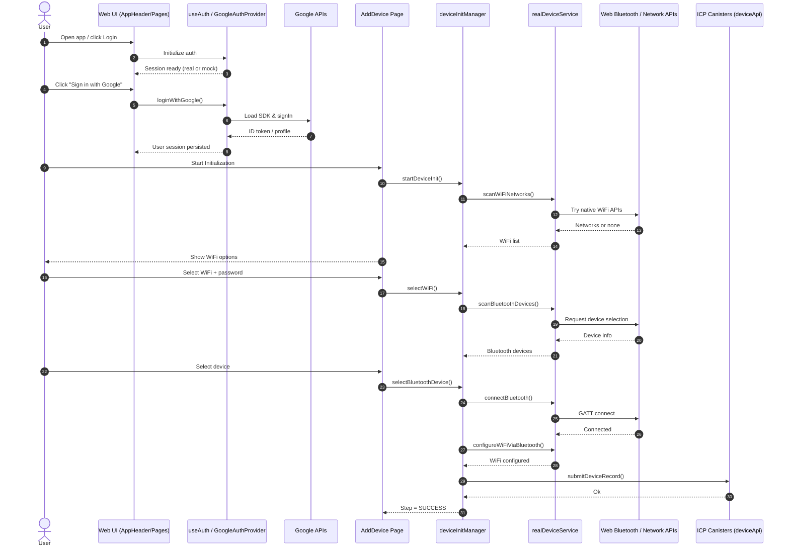
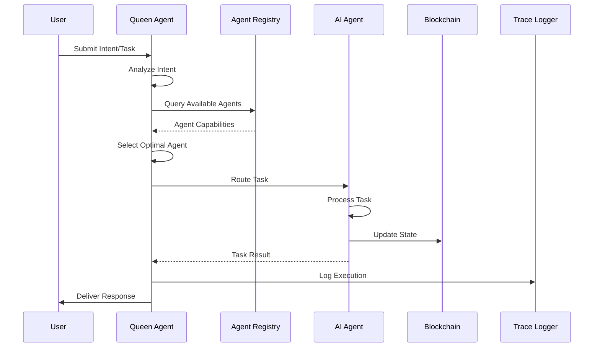

# AIO-2030: Super AI Decentralized Network

A comprehensive decentralized AI ecosystem built on Internet Computer Protocol (ICP) that fundamentally reconstructs the AI interaction paradigm through blockchain technology and agent collaboration networks.

## V0.1 Demo Deployed canisters
URLs:
  Frontend canister via browser
    aio-base-frontend: https://scswk-paaaa-aaaau-abyaq-cai.icp0.io/
  Backend canister via Candid interface:
    aio-base-backend: https://a4gq6-oaaaa-aaaab-qaa4q-cai.raw.icp0.io/?id=sftq6-cyaaa-aaaau-abyaa-cai


## Table of Contents

- [Overview](#overview)
- [Architecture](#architecture)
- [Core Components](#core-components)
- [Project Structure](#project-structure)
- [Tech Stack](#tech-stack)
- [Univoice AI Agent Implementation](#univoice-ai-agent-implementation)
- [Agent Interaction Implementation](#agent-interaction-implementation)
- [Token Economy](#token-economy)
- [AIO Protocol Stack](#aio-protocol-stack)
- [Quick Start](#quick-start)
- [API Reference](#api-reference)
- [Development](#development)
- [Security Features](#security-features)
- [Contributing](#contributing)
- [License](#license)

## What's New (Recent Updates)

The following improvements were implemented across the Chat Nexus frontend and shared components:

- Navigation and Header
  - Bottom navigation: renamed `Profile` to `AI`, changed the icon to Sparkles, and made it point to the home (`/`).
  - Introduced a reusable `AppHeader` that unifies avatar click-to-profile, login/logout, and layout across pages.
  - Avatar click (mobile and desktop) navigates to `/profile` consistently.

- Authentication (Google OAuth)
  - Added a dedicated hook `useGoogleAuth` that encapsulates all Google OAuth logic with safe fallbacks.
  - Added `GoogleAuthProvider` which lazy-loads Google API, initializes auth, and allows the app to continue with a mock fallback if misconfigured or blocked by CSP.
  - Updated `useAuth` to integrate Google login/logout, status validation, and session sync.
  - Switched env keys to Vite conventions: `VITE_GOOGLE_CLIENT_ID`, `VITE_API_URL`, `VITE_ENVIRONMENT`.
  - Updated CSP (`.ic-assets.json5`) to allow Google APIs/images: `apis.google.com`, `accounts.google.com`, `www.googleapis.com`, `lh3.googleusercontent.com`.

- Layout and Content Visibility
  - Fixed content being obscured by the bottom nav on mobile by applying responsive `calc(100vh - header - nav)` height rules.
  - Adjusted `ChatBox` and page containers (`Index.tsx`, etc.) to use `max-h`/`min-h-0` and reduced bottom margins on mobile.

- Wallet Section Scope
  - Removed the inline "My Wallet" cards from `Index.tsx`, `Contracts.tsx`, `MyDevices.tsx`, and `Shop.tsx`.
  - Kept the wallet section exclusively on `Profile.tsx` per product requirements.

- Device Initialization Flow (Add Device) - **NEW Bluetooth-First Approach**
  - **Complete Flow Redesign**: Industry-standard IoT device onboarding with 5-step process
  - **Bluetooth-First Configuration**: 
    1. Scan and connect to Bluetooth devices
    2. Request WiFi networks from device via Bluetooth
    3. Configure WiFi credentials through secure Bluetooth channel
    4. Device connects to WiFi autonomously
    5. Submit configured device to IC backend canister
  - **Enhanced Technical Implementation**:
    - `deviceInitManager`: New step sequence (BLUETOOTH_SCAN → BLUETOOTH_CONNECT → WIFI_SCAN → WIFI_CONFIG → SUCCESS)
    - `realDeviceService`: Device-side WiFi scanning via `requestWiFiScanFromDevice()`
    - `submitDeviceRecordToCanister()`: Direct IC backend integration for device persistence
  - **Improved User Experience**: Real-time progress tracking, better error handling, mobile-responsive design
  - **Security**: Secure credential transmission through established Bluetooth connection

> **Technical Advantage**: This approach eliminates browser WiFi API limitations by leveraging device-side scanning, providing a more reliable and industry-standard IoT configuration experience.

### Environment Configuration (Vite)

- Create `.env` and set at least:

```
VITE_GOOGLE_CLIENT_ID=your_google_client_id
VITE_API_URL=http://localhost:3000
VITE_ENVIRONMENT=development
```

### CSP for ICP Hosting

If you host on ICP with `.ic-assets.json5`, ensure the following directives include Google endpoints:

- `script-src`: `https://apis.google.com https://accounts.google.com`
- `connect-src`: `https://accounts.google.com https://www.googleapis.com`
- `img-src`: `https://lh3.googleusercontent.com`

### Usage Tips

- Avatar in the header navigates to `/profile`.
- Bottom nav `AI` goes to the home chat.
- Add Device flow: WiFi scan → password dialog → Bluetooth scan → connection and WiFi provisioning.


## Overview

**AIO-2030 (Super AI Decentralized Network)** introduces the *De-Super Agentic AI Network*, featuring:

- Contract-based agent registration framework
- On-chain task traceability and incentive mechanisms
- Decentralized AI agent collaboration network
- Advanced blockchain-based backend services
- Multi-chain protocol (MCP) operations
- Comprehensive token economy with staking and rewards
- Distributed computing infrastructure

### What Makes AIO-2030 Unique

- **True Decentralization**: Built on Internet Computer (ICP) for user-friendly Web 3.0 experience
- **Agent Orchestration**: Queen Agent serves as superintelligence orchestrator
- **Multi-Chain Support**: Standardized protocols for cross-chain AI operations
- **Token Economy**: $AIO token with staking, rewards, and governance mechanisms
- **Open Ecosystem**: Composable AI Agent collaboration network

## Architecture

### System Architecture

```
┌─────────────────┐    ┌─────────────────┐    ┌─────────────────┐
│   Frontend      │    │   Backend       │    │   AIO Pod       │
│   (React/TS)    │◄──►│   (Rust/ICP)    │◄──►│   (Python)      │
│                 │    │                 │    │                 │
│ • User Interface│    │ • Smart Contract│    │ • MCP Execution │
│ • Agent Store   │    │ • Token Economy │    │ • Task Runtime  │
│ • Chat System   │    │ • Trace Logging │    │ • File Handling │
└─────────────────┘    └─────────────────┘    └─────────────────┘
         │                       │                       │
         └───────────────────────┼───────────────────────┘
                                 │
         ┌───────────────────────▼───────────────────────┐
         │              Queen Agent                      │
         │        (Intelligence Orchestrator)            │
         │                                               │
         │ • Intent Analysis  • Task Decomposition       │
         │ • Agent Selection  • Quality Control          │
         │ • Plan Generation  • Ecosystem Integration    │
         └───────────────────────────────────────────────┘
```

### Data Flow

```
User Request → Intent Analysis → Task Decomposition → Agent Selection → Execution → Quality Control → Response
                     ↓                    ↓                  ↓             ↓              ↓
            Trace Logging → Work Ledger → Token Economy → Mining Rewards → Audit Trail
```

### Component Interaction Sequence



### Dapp Architecture (Detailed)

This dapp is composed of three cooperating planes. Each plane is independently testable, deployable, and replaceable.

1) Interaction Plane (Web Frontend)
- Tech: React + TypeScript (Vite), shadcn/ui, Radix, Tailwind
- State: React Context + TanStack Query (server/cache), localStorage for sessions
- Responsibilities:
  - Routing, layout, and client-side rendering
  - Authentication (Wallet / Google OAuth)
  - AI chat UX, agent orchestration UI, device initialization UX
  - Calls dapp APIs (ICP canisters, AIO Pod, external providers)

2) Coordination & Ledger Plane (ICP Canisters)
- Tech: Rust (canister smart contracts)
- Responsibilities:
  - Token economy (credits/AIO), staking, grants, ledger updates
  - Agent/MCP metadata, capability registry, work-ledger, traces
  - Contract-based agent registration and governance
  - Candid interfaces provide stable API contracts

3) Execution Plane (AIO Pod / External Services)
- Tech: Python VM, isolated subprocesses, REST API
- Responsibilities:
  - MCP execution, long-running tasks, tool/agent integration
  - File handling and permissions, streaming outputs (SSE/stdio)
  - Bridges to third‑party AI services where appropriate

Cross-Cutting Concerns
- Observability: Trace IDs across UI → Canisters → AIO Pod
- Security: CSP, strict origin policies, permission prompts (Bluetooth), defensive parsing
- Compatibility: Graceful feature detection (e.g., Web Bluetooth), mock fallbacks in non-supported browsers

Runtime View
- Browser loads web app → `AppHeader` and bottom nav render → routes load feature modules
- Auth initializes early (GoogleAuthProvider), wallet available via Plug integration
- Feature flows (e.g., Add Device) call `deviceInitManager`, which delegates to `realDeviceService` (web APIs) or safely falls back

Deployment View
- Frontend built via Vite → deployed as ICP asset canister (or static host)
- Canisters deployed via DFX (local/dev/prod networks)
- AIO Pod runs as a separately managed service; endpoints configured via env

### Technical Capability Specification

This section standardizes the functional and non‑functional capabilities exposed by the dapp.

1) Functional Capabilities
- Authentication
  - Google OAuth 2.0 via `useGoogleAuth` + `GoogleAuthProvider`
  - Wallet connect (Plug) with session persistence
  - Requirements: `VITE_GOOGLE_CLIENT_ID`, CSP allowances for Google endpoints
- AI Chat & Agent UI
  - Chat container with message virtualization, tool outputs, and rich responses
  - Prompt frameworks (intent/index/protocol adapters) in `src/.../config`
- Device Initialization (Bluetooth-First IoT Onboarding)
  - **New 5-Step Flow**: Bluetooth scan → device connect → WiFi request → WiFi config → canister submit
  - **Device-Side WiFi Scanning**: Eliminates browser WiFi API limitations
  - **Secure Configuration**: Credentials transmitted via established Bluetooth channel
  - **IC Backend Integration**: Direct canister storage with `submitDeviceRecordToCanister()`
  - **Implementation**: `services/deviceInitManager.ts` + `services/realDeviceService.ts`
  - **Progressive Enhancement**: Web Bluetooth API with comprehensive fallbacks
- Wallet Views
  - Wallet presentation restricted to `Profile` page for clarity

2) Non‑Functional Capabilities
- Performance: Vite bundling, lazy loading by routes/components where feasible; chunk size warnings monitored
- Security:
  - CSP enforced (ICP `.ic-assets.json5`) with explicit allow-lists for scripts/connect/img
  - OAuth tokens kept in memory and localStorage only where strictly required; errors sanitized
  - Web Bluetooth requests must originate from user gestures and HTTPS contexts
- Accessibility: Color contrast aware palettes; keyboard and screen‑reader friendly components from Radix/shadcn
- Internationalization: Copy structure designed for simple extraction (future i18n plumbing ready)

3) API Contracts (Selected)
- Device Services (`realDeviceService`) - **Updated for Bluetooth-First Flow**
  - `scanBluetoothDevices(): Promise<BluetoothDevice[]>`
    - Returns list with fields: `id,name,rssi,type,mac,paired?,connectable?`
  - `connectBluetooth(device): Promise<boolean>`
    - Establishes secure GATT connection to IoT device
  - `requestWiFiScanFromDevice(device): Promise<WiFiNetwork[]>` **NEW**
    - Device-side WiFi scanning via Bluetooth, returns: `id,name,security,strength,frequency?,channel?`
  - `configureWiFiViaBluetooth(device, wifi): Promise<boolean>`
    - Secure WiFi credential transmission via established Bluetooth channel
  - `submitDeviceRecordToCanister(record): Promise<boolean>` **NEW**
    - Direct IC backend integration for device persistence
  - All methods include comprehensive error handling with user-friendly messages
- Device Initialization Manager (`deviceInitManager`) - **New Flow**
  - **Updated Steps**: INIT → BLUETOOTH_SCAN → BLUETOOTH_SELECT → BLUETOOTH_CONNECT → WIFI_SCAN → WIFI_SELECT → WIFI_CONFIG → SUCCESS
  - **Core Methods**: `startDeviceInit()`, `selectBluetoothDevice(device)`, `selectWiFi(wifi)`, `submitDeviceRecord()`
  - **Enhanced State**: Includes Bluetooth connection status, WiFi configuration progress, IC submission status

4) Data Models (simplified) - **Updated for New Flow**
```ts
type WiFiNetwork = { id: string; name: string; security: string; strength: number; password?: string; frequency?: number; channel?: number };
type BluetoothDevice = { id: string; name: string; rssi: number; type: string; mac: string; paired?: boolean; connectable?: boolean };
type DeviceRecord = { 
  name: string; 
  type: string; 
  macAddress: string; 
  wifiNetwork: string; 
  status: 'Connected' | 'Disconnected' | 'Configuring'; 
  connectedAt: string;
  deviceId?: string; // IC canister-generated ID
};
type DeviceInitStep = 'init' | 'bluetooth_scan' | 'bluetooth_select' | 'bluetooth_connect' | 'wifi_scan' | 'wifi_select' | 'wifi_config' | 'success';
```

5) Error Handling & UX Rules
- All async operations are wrapped with try/catch and surfaced through non‑blocking toasts or inline banners
- `GoogleAuthProvider` never blocks app render; when Google fails it shows a soft warning and falls back to mock auth
- Device flows show step progress and allow retry on recoverable errors

6) Environment & Feature Flags
- Required env (Vite):
  - `VITE_GOOGLE_CLIENT_ID`, `VITE_API_URL`, `VITE_ENVIRONMENT`
- Optional flags (future):
  - `VITE_ENABLE_WEB_BLUETOOTH`, `VITE_ENABLE_WIFI_SCAN`

7) Security & CSP Specification
- Example ICP `.ic-assets.json5` additions:
  - `script-src`: include `https://apis.google.com https://accounts.google.com`
  - `connect-src`: include `https://accounts.google.com https://www.googleapis.com`
  - `img-src`: include `https://lh3.googleusercontent.com`
- Never load third‑party scripts from untrusted origins; prefer first‑party hosting

8) Browser Support Matrix (guideline)
- Chrome (latest): Full (Web Bluetooth behind permissions; WiFi enumeration often limited)
- Edge (latest): Similar to Chrome
- Safari/Firefox: No Web Bluetooth; flows automatically fall back to mock implementations

9) Coding Standards (Frontend)
- TypeScript strictness, explicit types on exported APIs
- UI: shadcn/ui + Radix; Tailwind utility classes with semantic grouping
- State: avoid deep prop-drilling; prefer context or query cache
- Error messages: human‑readable and action‑oriented; never expose sensitive details

## Core Components

| **Component** | **Description** | **Technology** |
|---------------|-----------------|----------------|
| **User** | Initiates AI tasks through intent-based requests | React Frontend |
| **Developer** | Contributes agents and MCP servers to the ecosystem | Developer Portal |
| **Queen Agent** | Superintelligence orchestrator for capability discovery and execution | AI Coordination |
| **Arbiter** | Token-based operations governance via smart contracts | ICP Canisters |
| **AIO-MCP Server** | Generalized AI service nodes with standardized interfaces | Python/Rust |
| **Univoice AI Agent** | Voice-based AI interaction agent with ElevenLabs integration | TypeScript/React + ElevenLabs API |
| **Frontend** | React-based user interface with comprehensive features | TypeScript/React |
| **Backend** | Blockchain-based services for the entire ecosystem | Rust/ICP |
| **AIO Pod** | Execution environment for MCP servers and tasks | Python VM |

## Project Structure

```
alaya-network/
├── aio-pod/                    # AIO Pod Server Components (Python)
│   ├── uploads/mcp/           # MCP executable files storage
│   └── api/                   # REST API endpoints
├── src/
│   ├── aio-base-backend/      # Backend Services (Rust + ICP)
│   │   ├── src/
│   │   │   ├── agent_asset_types.rs     # Agent lifecycle management
│   │   │   ├── mcp_asset_types.rs       # Multi-Chain Protocol handling
│   │   │   ├── token_economy.rs         # Economic system implementation
│   │   │   ├── trace_storage.rs         # Execution tracking
│   │   │   ├── mining_reword.rs         # Reward distribution
│   │   │   └── stable_mem_storage.rs    # Persistent storage
│   │   └── aio-base-backend.did         # Candid interface definitions
│   ├── aio-base-frontend/     # Frontend Application (TypeScript + React)
│   │   ├── src/
│   │   │   ├── components/              # UI components
│   │   │   ├── routes/                  # Application routes
│   │   │   ├── services/                # API services
│   │   │   ├── hooks/                   # React hooks
│   │   │   ├── contexts/                # React contexts
│   │   │   ├── config/                  # Prompt configurations
│   │   │   └── runtime/                 # AIO Protocol runtime
│   │   └── public/                      # Static assets
│   ├── alaya-chat-nexus-frontend/  # Chat Nexus Frontend (TypeScript + React)
│   │   ├── src/
│   │   │   ├── components/          # UI components
│   │   │   ├── pages/               # Application pages
│   │   │   ├── services/            # API services
│   │   │   └── utils/               # Utility functions
│   │   └── public/                  # Static assets
│   └── alaya-chat-nexus-*/          # Other Chat Components
├── univoice-whisper-chat/     # Voice Chat Components
├── univoice-ai-agent/         # Univoice AI Agent Implementation
│   ├── src/
│   │   ├── components/         # Voice chat UI components
│   │   ├── hooks/              # ElevenLabs integration hooks
│   │   ├── services/           # Voice processing services
│   │   └── utils/              # Voice utilities and helpers
│   └── public/                 # Voice assets and configurations
├── target/                    # Rust Build Output
├── certificates/              # Certificate Files
└── test_files/               # Test files and examples
```

## Tech Stack

### Frontend (React/TypeScript)
- **Framework**: React 18.3.1 + TypeScript
- **Build Tool**: Vite
- **UI Framework**: shadcn/ui + Radix UI + Tailwind CSS
- **State Management**: React Context + TanStack Query
- **Routing**: React Router DOM
- **Blockchain Integration**: Dfinity Agent
- **Additional Libraries**: axios, react-hook-form, zod, lucide-react, recharts

### Backend (Rust/ICP)
- **Language**: Rust (latest stable)
- **Platform**: Internet Computer Protocol (ICP)
- **Storage**: Stable Memory Storage
- **Architecture**: Smart Contracts (Canisters)
- **API**: Candid Interface Definition Language

### AIO Pod (Python)
- **Runtime**: Python VM Environment
- **API**: REST API with CORS support
- **File Handling**: Automated permission management
- **Execution**: Subprocess-based MCP execution

## Univoice AI Agent Implementation

The Univoice AI Agent is a sophisticated voice-based AI interaction system that integrates ElevenLabs' advanced voice synthesis and conversation capabilities with the AIO-2030 ecosystem. It provides natural, real-time voice conversations with AI agents through a React-based frontend interface.

### Architecture Overview

```
┌─────────────────┐    ┌─────────────────┐    ┌─────────────────┐
│   React UI      │    │   Voice Hook    │    │   ElevenLabs    │
│   Components    │◄──►│   (useElevenLabs│◄──►│   API & WebSocket│
│                 │    │   Stable)       │    │                 │
│ • Voice Controls│    │ • State Mgmt    │    │ • Voice Synthesis│
│ • Chat Display  │    │ • Session Ctrl  │    │ • Conversation  │
│ • Status Ind.   │    │ • Error Handling│    │ • Real-time I/O │
└─────────────────┘    └─────────────────┘    └─────────────────┘
         │                       │                       │
         └───────────────────────┼───────────────────────┘
                                 │
         ┌───────────────────────▼───────────────────────┐
         │           Global State Manager                │
         │        (ElevenLabsGlobalState)                │
         │                                               │
         │ • Persistent State Storage                    │
         │ • Cross-Component State Sync                  │
         │ • localStorage Persistence                    │
         │ • State Change Notifications                  │
         └───────────────────────────────────────────────┘
```

### Core Components

#### 1. Voice Chat Interface (`ElevenLabsVoiceChat.tsx`)
- **Purpose**: Main voice interaction UI component
- **Features**:
  - Voice session controls (Start/Stop Voice)
  - Real-time status indicators
  - Chat message display with timestamps
  - Error handling and recovery
  - Responsive design for mobile/desktop

#### 2. Voice Hook (`useElevenLabsStable`)
- **Purpose**: Core voice functionality and state management
- **Capabilities**:
  - ElevenLabs conversation management
  - Session lifecycle control
  - Voice recording and playback
  - Error handling and recovery
  - State persistence across sessions

#### 3. Global State Manager (`ElevenLabsGlobalState`)
- **Purpose**: Centralized state management for voice sessions
- **Features**:
  - Singleton pattern for global state access
  - Persistent storage via localStorage
  - Publish-subscribe pattern for state changes
  - Cross-component state synchronization
  - Automatic state cleanup and validation

### Technical Implementation

#### State Management Architecture

```typescript
class ElevenLabsGlobalState {
  private static instance: ElevenLabsGlobalState;
  private state: Map<string, any> = new Map();
  private listeners: Map<string, Set<() => void>> = new Map();
  private conversationInstances: Map<string, any> = new Map();

  // Singleton pattern ensures single state instance
  static getInstance(): ElevenLabsGlobalState {
    if (!ElevenLabsGlobalState.instance) {
      ElevenLabsGlobalState.instance = new ElevenLabsGlobalState();
    }
    return ElevenLabsGlobalState.instance;
  }

  // State operations with persistence
  updateState(agentId: string, updates: Partial<any>): void
  getState(agentId: string): any
  persistState(agentId: string, state: any): void
  loadPersistedState(agentId: string): any
}
```

#### Voice Session Lifecycle

```typescript
const useElevenLabsStable = (agentId: string) => {
  // Session initialization
  const startSession = async () => {
    // 1. Validate agent configuration
    // 2. Request microphone permissions
    // 3. Get signed URL from ElevenLabs
    // 4. Establish WebSocket connection
    // 5. Update global state
  };

  // Session management
  const endSession = async () => {
    // 1. Gracefully close ElevenLabs connection
    // 2. Clear session state
    // 3. Reset local references
    // 4. Update global state
  };

  // Voice recording control
  const startVoiceRecording = async () => {
    // 1. Check session status
    // 2. Activate voice input
    // 3. Begin real-time processing
  };
};
```

### Integration with ElevenLabs

#### API Configuration
```typescript
// Environment variables required
VITE_ELEVENLABS_API_KEY=your_api_key_here

// ElevenLabs conversation configuration
const conversation = useConversation({
  onConnect: () => {
    // Handle successful connection
    updateSessionState({ isSessionActive: true });
    addSystemMessage('Voice connection established');
  },
  
  onDisconnect: (reason) => {
    // Handle disconnection with reason analysis
    if (reason?.reason === 'user') {
      // User-initiated disconnect
      updateSessionState({ isSessionActive: false });
    } else {
      // System or error disconnect
      handleSystemDisconnect(reason);
    }
  },
  
  onMessage: (message) => {
    // Process incoming voice messages
    processVoiceMessage(message);
  }
});
```

#### Voice Processing Pipeline

```typescript
// Voice input processing
const processVoiceInput = async (audioData: ArrayBuffer) => {
  try {
    // 1. Audio format validation
    // 2. Send to ElevenLabs for processing
    // 3. Receive AI response
    // 4. Update conversation state
    // 5. Display in UI
  } catch (error) {
    handleVoiceProcessingError(error);
  }
};

// Voice output handling
const handleVoiceOutput = (response: any) => {
  // 1. Extract audio data
  // 2. Queue for playback
  // 3. Update speaking status
  // 4. Handle playback completion
};
```

### Error Handling & Recovery

#### Comprehensive Error Management
```typescript
// Error categorization and handling
const handleError = (error: any, context: string) => {
  switch (context) {
    case 'connection':
      handleConnectionError(error);
      break;
    case 'voice_processing':
      handleVoiceProcessingError(error);
      break;
    case 'permission':
      handlePermissionError(error);
      break;
    default:
      handleGenericError(error);
  }
};

// Automatic recovery mechanisms
const attemptRecovery = async (error: any) => {
  if (isRecoverableError(error)) {
    await retryOperation();
  } else {
    fallbackToTextMode();
  }
};
```

#### State Consistency Management
```typescript
// State validation and cleanup
const validateState = (state: any) => {
  const inconsistencies = [];
  
  if (state.isSessionActive && !state.conversationId) {
    inconsistencies.push('Active session without conversation ID');
  }
  
  if (state.status === 'connecting' && !state.isSessionActive) {
    inconsistencies.push('Connecting status without active session');
  }
  
  return inconsistencies;
};

// Automatic state repair
const repairState = (inconsistencies: string[]) => {
  inconsistencies.forEach(issue => {
    console.log(`Repairing state issue: ${issue}`);
    // Apply appropriate fixes
  });
};
```

### Performance Optimizations

#### Memory Management
- **Efficient State Updates**: Only update changed state properties
- **Event Listener Cleanup**: Proper cleanup of WebSocket listeners
- **Memory Leak Prevention**: Automatic cleanup of abandoned sessions

#### Real-time Performance
- **WebSocket Optimization**: Efficient message handling and buffering
- **Audio Processing**: Optimized audio format handling
- **UI Responsiveness**: Non-blocking voice operations

### Security Features

#### Permission Management
```typescript
// Microphone permission handling
const requestMicrophonePermission = async () => {
  try {
    const stream = await navigator.mediaDevices.getUserMedia({ 
      audio: true 
    });
    return stream;
  } catch (error) {
    if (error.name === 'NotAllowedError') {
      throw new Error('Microphone access denied by user');
    }
    throw error;
  }
};
```

#### Data Privacy
- **Local Processing**: Voice data processed locally when possible
- **Secure Transmission**: Encrypted communication with ElevenLabs
- **Session Isolation**: Separate state for different agent sessions

### Browser Compatibility

#### Supported Browsers
- **Chrome/Edge**: Full support with WebRTC and WebSocket
- **Firefox**: Full support with some audio format limitations
- **Safari**: Limited support, may require fallback implementations

#### Feature Detection
```typescript
// Progressive enhancement approach
const checkBrowserCapabilities = () => {
  const capabilities = {
    webRTC: !!navigator.mediaDevices,
    webSocket: !!window.WebSocket,
    audioContext: !!window.AudioContext,
    mediaRecorder: !!window.MediaRecorder
  };
  
  return capabilities;
};
```

### Development & Testing

#### Development Environment Setup
```bash
# Install dependencies
npm install

# Set environment variables
cp .env.example .env
# Edit .env with your ElevenLabs API key

# Start development server
npm run dev

# Run tests
npm run test
```

#### Testing Strategy
- **Unit Tests**: Component and hook testing
- **Integration Tests**: Voice processing pipeline testing
- **E2E Tests**: Complete voice conversation flow testing
- **Performance Tests**: Memory and CPU usage monitoring

#### Debugging Tools
```typescript
// Comprehensive logging system
const debugLog = (level: 'info' | 'warn' | 'error', message: string, data?: any) => {
  if (process.env.NODE_ENV === 'development') {
    console.log(`[${level.toUpperCase()}] ${message}`, data);
  }
};

// State inspection utilities
const inspectState = (agentId: string) => {
  const state = globalState.getState(agentId);
  console.log('Current state:', state);
  return state;
};
```

### Deployment & Configuration

#### Production Configuration
```typescript
// Environment-specific configurations
const config = {
  development: {
    apiUrl: 'http://localhost:3001',
    enableDebugLogging: true,
    mockMode: false
  },
  production: {
    apiUrl: 'https://api.elevenlabs.io',
    enableDebugLogging: false,
    mockMode: false
  }
};
```

#### Monitoring & Analytics
- **Session Metrics**: Connection success rates, error frequencies
- **Performance Metrics**: Response times, audio quality
- **User Experience**: Voice interaction patterns, session duration

### Future Enhancements

#### Planned Features
- **Multi-language Support**: Internationalization for voice interactions
- **Voice Customization**: User-selectable voice personalities
- **Advanced AI Integration**: Integration with additional AI models
- **Offline Capabilities**: Local voice processing when possible

#### Scalability Improvements
- **Load Balancing**: Multiple ElevenLabs endpoints
- **Caching**: Voice response caching for common queries
- **CDN Integration**: Global voice asset distribution

## Agent Interaction Implementation

The AIO-2030 ecosystem implements a sophisticated agent interaction system that enables seamless communication between users, AI agents, and the blockchain infrastructure. This section provides comprehensive technical documentation on how agents interact, communicate, and execute tasks within the decentralized network.

### Agent Interaction Architecture

#### High-Level System Design

```
┌─────────────────┐    ┌─────────────────┐    ┌─────────────────┐
│   User Layer    │    │   Agent Layer   │    │   Blockchain    │
│                 │    │                 │    │   Layer         │
│ • Intent Input  │◄──►│ • Agent Registry│◄──►│ • Smart        │
│ • Task Request  │    │ • Capability    │    │   Contracts     │
│ • Response      │    │   Discovery     │    │ • Token Economy │
│   Display       │    │ • Execution     │    │ • Trace Logging │
└─────────────────┘    └─────────────────┘    └─────────────────┘
         │                       │                       │
         └───────────────────────┼───────────────────────┘
                                 │
         ┌───────────────────────▼───────────────────────┐
         │              Queen Agent                      │
         │        (Intelligence Orchestrator)            │
         │                                               │
         │ • Intent Analysis & Classification            │
         │ • Task Decomposition & Planning               │
         │ • Agent Selection & Routing                   │
         │ • Quality Control & Validation                │
         │ • Response Aggregation & Delivery             │
         └───────────────────────────────────────────────┘
```

#### Agent Communication Flow



### Agent Registration & Discovery

#### Agent Registration Process

```typescript
// Agent registration interface
interface AgentRegistration {
  agentId: string;
  name: string;
  description: string;
  capabilities: AgentCapability[];
  metadata: AgentMetadata;
  stakeAmount: bigint;
  owner: string;
  status: 'active' | 'inactive' | 'suspended';
}

// Agent capability definition
interface AgentCapability {
  id: string;
  name: string;
  description: string;
  inputSchema: JSONSchema;
  outputSchema: JSONSchema;
  executionType: 'sync' | 'async' | 'streaming';
  estimatedCost: number;
  maxExecutionTime: number;
}
```

#### Smart Contract Integration

```rust
// Agent registration smart contract
#[derive(CandidType, Deserialize)]
pub struct AgentItem {
    pub id: u64,
    pub name: String,
    pub description: String,
    pub capabilities: Vec<AgentCapability>,
    pub metadata: AgentMetadata,
    pub stake_amount: u64,
    pub owner: Principal,
    pub status: AgentStatus,
    pub created_at: u64,
    pub updated_at: u64,
}

#[update]
pub async fn register_agent(
    agent: AgentItem,
    principal_id: String,
) -> Result<u64, String> {
    // Validate agent data
    validate_agent_data(&agent)?;
    
    // Check stake requirements
    verify_stake_requirements(&agent.stake_amount)?;
    
    // Register agent in storage
    let agent_id = self.agent_storage.add_agent(agent, principal_id).await?;
    
    // Emit registration event
    self.event_emitter.emit_agent_registered(agent_id).await?;
    
    Ok(agent_id)
}
```

### Intent Processing & Task Routing

#### Intent Analysis System

```typescript
// Intent classification and analysis
class IntentAnalyzer {
  private nlpProcessor: NLPProcessor;
  private intentClassifier: IntentClassifier;
  private contextAnalyzer: ContextAnalyzer;

  async analyzeIntent(userInput: string, context: UserContext): Promise<IntentAnalysis> {
    // 1. Natural language processing
    const processedInput = await this.nlpProcessor.process(userInput);
    
    // 2. Intent classification
    const intent = await this.intentClassifier.classify(processedInput);
    
    // 3. Context analysis
    const enhancedContext = await this.contextAnalyzer.analyze(context, intent);
    
    // 4. Task decomposition
    const tasks = await this.decomposeIntent(intent, enhancedContext);
    
    return {
      originalInput: userInput,
      intent,
      context: enhancedContext,
      tasks,
      confidence: intent.confidence,
      suggestedAgents: await this.suggestAgents(tasks)
    };
  }

  private async decomposeIntent(intent: Intent, context: EnhancedContext): Promise<Task[]> {
    // Break down complex intents into executable tasks
    const taskDecomposer = new TaskDecomposer();
    return await taskDecomposer.decompose(intent, context);
  }
}
```

#### Agent Selection Algorithm

```typescript
// Intelligent agent selection based on multiple factors
class AgentSelector {
  private agentRegistry: AgentRegistry;
  private performanceTracker: PerformanceTracker;
  private costAnalyzer: CostAnalyzer;

  async selectOptimalAgent(tasks: Task[], context: ExecutionContext): Promise<AgentSelection> {
    const availableAgents = await this.agentRegistry.getAvailableAgents();
    
    // Score agents based on multiple criteria
    const scoredAgents = await Promise.all(
      availableAgents.map(async (agent) => {
        const score = await this.calculateAgentScore(agent, tasks, context);
        return { agent, score };
      })
    );

    // Sort by score and return optimal selection
    const sortedAgents = scoredAgents.sort((a, b) => b.score - a.score);
    
    return {
      primaryAgent: sortedAgents[0].agent,
      fallbackAgents: sortedAgents.slice(1, 4),
      selectionReason: this.explainSelection(sortedAgents[0], tasks, context)
    };
  }

  private async calculateAgentScore(
    agent: Agent, 
    tasks: Task[], 
    context: ExecutionContext
  ): Promise<number> {
    const scores = {
      capability: this.calculateCapabilityScore(agent, tasks),
      performance: await this.calculatePerformanceScore(agent),
      cost: this.calculateCostScore(agent, tasks),
      availability: this.calculateAvailabilityScore(agent),
      reputation: await this.calculateReputationScore(agent)
    };

    // Weighted scoring algorithm
    return (
      scores.capability * 0.3 +
      scores.performance * 0.25 +
      scores.cost * 0.2 +
      scores.availability * 0.15 +
      scores.reputation * 0.1
    );
  }
}
```

### Task Execution & Orchestration

#### Task Execution Engine

```typescript
// Task execution orchestration
class TaskExecutionEngine {
  private agentExecutor: AgentExecutor;
  private taskScheduler: TaskScheduler;
  private progressTracker: ProgressTracker;
  private errorHandler: ErrorHandler;

  async executeTasks(
    tasks: Task[], 
    agentSelection: AgentSelection, 
    context: ExecutionContext
  ): Promise<ExecutionResult> {
    try {
      // Initialize execution context
      const executionId = this.generateExecutionId();
      const executionContext = {
        ...context,
        executionId,
        startTime: Date.now()
      };

      // Schedule and execute tasks
      const scheduledTasks = await this.taskScheduler.schedule(tasks, agentSelection);
      const results = await this.executeScheduledTasks(scheduledTasks, executionContext);

      // Aggregate results
      const aggregatedResult = await this.aggregateResults(results, executionContext);

      return {
        executionId,
        status: 'completed',
        results: aggregatedResult,
        executionTime: Date.now() - executionContext.startTime,
        metadata: this.generateExecutionMetadata(executionContext)
      };

    } catch (error) {
      return await this.handleExecutionError(error, context);
    }
  }

  private async executeScheduledTasks(
    scheduledTasks: ScheduledTask[], 
    context: ExecutionContext
  ): Promise<TaskResult[]> {
    const results: TaskResult[] = [];
    
    for (const scheduledTask of scheduledTasks) {
      try {
        // Execute individual task
        const result = await this.agentExecutor.execute(scheduledTask, context);
        results.push(result);
        
        // Update progress
        await this.progressTracker.updateProgress(context.executionId, result);
        
      } catch (error) {
        // Handle task-specific errors
        const errorResult = await this.errorHandler.handleTaskError(error, scheduledTask, context);
        results.push(errorResult);
      }
    }

    return results;
  }
}
```

#### Real-time Task Monitoring

```typescript
// Real-time execution monitoring
class TaskMonitor {
  private websocketManager: WebSocketManager;
  private eventEmitter: EventEmitter;
  private progressCache: Map<string, ExecutionProgress>;

  constructor() {
    this.setupWebSocketHandlers();
    this.setupEventHandlers();
  }

  private setupWebSocketHandlers() {
    this.websocketManager.on('task_progress', (data: TaskProgressData) => {
      this.updateProgress(data);
      this.broadcastProgress(data);
    });

    this.websocketManager.on('task_completed', (data: TaskCompletionData) => {
      this.handleTaskCompletion(data);
    });

    this.websocketManager.on('task_error', (data: TaskErrorData) => {
      this.handleTaskError(data);
    });
  }

  private updateProgress(data: TaskProgressData) {
    const { executionId, taskId, progress, message } = data;
    
    if (!this.progressCache.has(executionId)) {
      this.progressCache.set(executionId, new Map());
    }
    
    const executionProgress = this.progressCache.get(executionId)!;
    executionProgress.set(taskId, { progress, message, timestamp: Date.now() });
  }

  private broadcastProgress(data: TaskProgressData) {
    this.eventEmitter.emit('progress_update', {
      type: 'task_progress',
      data,
      timestamp: Date.now()
    });
  }
}
```

### Response Aggregation & Delivery

#### Response Processing Pipeline

```typescript
// Response aggregation and processing
class ResponseProcessor {
  private responseAggregator: ResponseAggregator;
  private qualityValidator: QualityValidator;
  private responseFormatter: ResponseFormatter;

  async processResponses(
    taskResults: TaskResult[], 
    originalIntent: Intent, 
    context: ExecutionContext
  ): Promise<ProcessedResponse> {
    // Aggregate multiple task results
    const aggregatedResponse = await this.responseAggregator.aggregate(taskResults);
    
    // Validate response quality
    const qualityScore = await this.qualityValidator.validate(aggregatedResponse, originalIntent);
    
    // Format response for user delivery
    const formattedResponse = await this.responseFormatter.format(
      aggregatedResponse, 
      qualityScore, 
      context
    );

    return {
      content: formattedResponse,
      quality: qualityScore,
      metadata: this.generateResponseMetadata(aggregatedResponse, context),
      suggestions: await this.generateSuggestions(aggregatedResponse, context)
    };
  }

  private async generateSuggestions(
    response: AggregatedResponse, 
    context: ExecutionContext
  ): Promise<Suggestion[]> {
    const suggestionEngine = new SuggestionEngine();
    return await suggestionEngine.generateSuggestions(response, context);
  }
}
```

#### Multi-Modal Response Handling

```typescript
// Multi-modal response delivery
class MultiModalResponseHandler {
  private textProcessor: TextProcessor;
  private imageProcessor: ImageProcessor;
  private audioProcessor: AudioProcessor;
  private videoProcessor: VideoProcessor;

  async processMultiModalResponse(
    response: ProcessedResponse, 
    userPreferences: UserPreferences
  ): Promise<MultiModalResponse> {
    const processedComponents: ResponseComponent[] = [];

    // Process text components
    if (response.content.text) {
      const processedText = await this.textProcessor.process(
        response.content.text, 
        userPreferences
      );
      processedComponents.push({
        type: 'text',
        content: processedText,
        priority: 1
      });
    }

    // Process image components
    if (response.content.images) {
      for (const image of response.content.images) {
        const processedImage = await this.imageProcessor.process(image, userPreferences);
        processedComponents.push({
          type: 'image',
          content: processedImage,
          priority: 2
        });
      }
    }

    // Process audio components
    if (response.content.audio) {
      const processedAudio = await this.audioProcessor.process(
        response.content.audio, 
        userPreferences
      );
      processedComponents.push({
        type: 'audio',
        content: processedAudio,
        priority: 3
      });
    }

    // Sort by priority and return
    return {
      components: processedComponents.sort((a, b) => a.priority - b.priority),
      metadata: response.metadata,
      quality: response.quality
    };
  }
}
```

### Error Handling & Recovery

#### Comprehensive Error Management

```typescript
// Error handling and recovery system
class ErrorHandlingSystem {
  private errorClassifier: ErrorClassifier;
  private recoveryStrategies: Map<ErrorType, RecoveryStrategy>;
  private fallbackHandler: FallbackHandler;

  constructor() {
    this.initializeRecoveryStrategies();
  }

  async handleError(error: Error, context: ErrorContext): Promise<ErrorHandlingResult> {
    // Classify error type
    const errorType = await this.errorClassifier.classify(error);
    
    // Attempt recovery
    const recoveryResult = await this.attemptRecovery(errorType, error, context);
    
    if (recoveryResult.success) {
      return {
        handled: true,
        recovered: true,
        result: recoveryResult.result,
        strategy: recoveryResult.strategy
      };
    }

    // Fallback handling
    const fallbackResult = await this.fallbackHandler.handle(error, context);
    
    return {
      handled: true,
      recovered: false,
      result: fallbackResult,
      strategy: 'fallback'
    };
  }

  private async attemptRecovery(
    errorType: ErrorType, 
    error: Error, 
    context: ErrorContext
  ): Promise<RecoveryResult> {
    const strategy = this.recoveryStrategies.get(errorType);
    
    if (!strategy) {
      return { success: false, reason: 'No recovery strategy available' };
    }

    try {
      const result = await strategy.execute(error, context);
      return { success: true, result, strategy: strategy.name };
    } catch (recoveryError) {
      return { 
        success: false, 
        reason: `Recovery failed: ${recoveryError.message}` 
      };
    }
  }

  private initializeRecoveryStrategies() {
    this.recoveryStrategies.set('network_error', new NetworkRecoveryStrategy());
    this.recoveryStrategies.set('agent_unavailable', new AgentRecoveryStrategy());
    this.recoveryStrategies.set('execution_timeout', new TimeoutRecoveryStrategy());
    this.recoveryStrategies.set('resource_insufficient', new ResourceRecoveryStrategy());
  }
}
```

### Performance Optimization

#### Caching & Optimization Strategies

```typescript
// Performance optimization system
class PerformanceOptimizer {
  private cacheManager: CacheManager;
  private loadBalancer: LoadBalancer;
  private resourceMonitor: ResourceMonitor;

  async optimizeExecution(
    tasks: Task[], 
    context: ExecutionContext
  ): Promise<OptimizedExecutionPlan> {
    // Check cache for similar tasks
    const cachedResults = await this.cacheManager.checkCache(tasks, context);
    
    // Load balance across available agents
    const loadBalancedTasks = await this.loadBalancer.distribute(tasks);
    
    // Monitor resource usage
    const resourceStatus = await this.resourceMonitor.getStatus();
    
    // Generate optimized execution plan
    return {
      tasks: loadBalancedTasks,
      cachedResults,
      resourceOptimizations: this.generateResourceOptimizations(resourceStatus),
      estimatedExecutionTime: this.estimateExecutionTime(loadBalancedTasks, resourceStatus)
    };
  }

  private generateResourceOptimizations(resourceStatus: ResourceStatus): ResourceOptimization[] {
    const optimizations: ResourceOptimization[] = [];
    
    if (resourceStatus.memoryUsage > 80) {
      optimizations.push({
        type: 'memory_cleanup',
        priority: 'high',
        action: 'clear_unused_cache'
      });
    }
    
    if (resourceStatus.cpuUsage > 90) {
      optimizations.push({
        type: 'cpu_throttling',
        priority: 'critical',
        action: 'reduce_concurrent_executions'
      });
    }
    
    return optimizations;
  }
}
```

### Security & Trust

#### Agent Trust & Verification

```typescript
// Agent trust and verification system
class TrustVerificationSystem {
  private reputationEngine: ReputationEngine;
  private verificationEngine: VerificationEngine;
  private trustScoreCalculator: TrustScoreCalculator;

  async verifyAgentTrust(agent: Agent, context: TrustContext): Promise<TrustVerification> {
    // Calculate reputation score
    const reputationScore = await this.reputationEngine.calculateScore(agent);
    
    // Verify agent credentials
    const credentialVerification = await this.verificationEngine.verifyCredentials(agent);
    
    // Calculate overall trust score
    const trustScore = await this.trustScoreCalculator.calculate({
      reputation: reputationScore,
      credentials: credentialVerification,
      stake: agent.stakeAmount,
      history: await this.getAgentHistory(agent.id)
    });

    return {
      agentId: agent.id,
      trustScore,
      reputation: reputationScore,
      credentials: credentialVerification,
      recommendations: await this.generateTrustRecommendations(trustScore, context)
    };
  }

  private async generateTrustRecommendations(
    trustScore: number, 
    context: TrustContext
  ): Promise<TrustRecommendation[]> {
    const recommendations: TrustRecommendation[] = [];
    
    if (trustScore < 0.5) {
      recommendations.push({
        type: 'warning',
        message: 'Low trust score detected',
        action: 'require_additional_verification'
      });
    }
    
    if (trustScore > 0.9) {
      recommendations.push({
        type: 'positive',
        message: 'High trust score',
        action: 'allow_premium_features'
      });
    }
    
    return recommendations;
  }
}
```

### Monitoring & Analytics

#### Real-time Monitoring System

```typescript
// Real-time monitoring and analytics
class MonitoringSystem {
  private metricsCollector: MetricsCollector;
  private alertManager: AlertManager;
  private analyticsEngine: AnalyticsEngine;

  async monitorExecution(executionId: string): Promise<MonitoringData> {
    // Collect real-time metrics
    const metrics = await this.metricsCollector.collect(executionId);
    
    // Check for alerts
    const alerts = await this.alertManager.checkAlerts(metrics);
    
    // Generate analytics
    const analytics = await this.analyticsEngine.generate(executionId, metrics);
    
    return {
      executionId,
      metrics,
      alerts,
      analytics,
      timestamp: Date.now()
    };
  }

  private async generatePerformanceReport(executionId: string): Promise<PerformanceReport> {
    const metrics = await this.metricsCollector.getHistoricalMetrics(executionId);
    
    return {
      executionId,
      totalExecutionTime: this.calculateTotalTime(metrics),
      averageResponseTime: this.calculateAverageResponseTime(metrics),
      successRate: this.calculateSuccessRate(metrics),
      resourceUtilization: this.calculateResourceUtilization(metrics),
      recommendations: await this.generatePerformanceRecommendations(metrics)
    };
  }
}
```

### Integration Patterns

#### External Service Integration

```typescript
// External service integration patterns
class ExternalServiceIntegrator {
  private serviceRegistry: ServiceRegistry;
  private adapterFactory: AdapterFactory;
  private rateLimiter: RateLimiter;

  async integrateService(
    serviceType: ServiceType, 
    configuration: ServiceConfiguration
  ): Promise<ServiceIntegration> {
    // Register service
    const service = await this.serviceRegistry.register(serviceType, configuration);
    
    // Create appropriate adapter
    const adapter = this.adapterFactory.create(serviceType, service);
    
    // Configure rate limiting
    const rateLimitConfig = await this.rateLimiter.configure(service, configuration);
    
    return {
      service,
      adapter,
      rateLimit: rateLimitConfig,
      healthCheck: await this.setupHealthCheck(service),
      fallback: await this.setupFallback(service)
    };
  }

  private async setupHealthCheck(service: ExternalService): Promise<HealthCheck> {
    return {
      endpoint: `${service.baseUrl}/health`,
      interval: 30000, // 30 seconds
      timeout: 5000,   // 5 seconds
      retries: 3
    };
  }
}
```

### Testing & Quality Assurance

#### Comprehensive Testing Framework

```typescript
// Testing and quality assurance system
class TestingFramework {
  private unitTester: UnitTester;
  private integrationTester: IntegrationTester;
  private performanceTester: PerformanceTester;
  private securityTester: SecurityTester;

  async runTestSuite(testConfiguration: TestConfiguration): Promise<TestResults> {
    const results: TestResults = {
      unit: await this.unitTester.runTests(testConfiguration.unit),
      integration: await this.integrationTester.runTests(testConfiguration.integration),
      performance: await this.performanceTester.runTests(testConfiguration.performance),
      security: await this.securityTester.runTests(testConfiguration.security)
    };

    // Generate comprehensive report
    const report = await this.generateTestReport(results);
    
    // Check quality gates
    const qualityGates = await this.checkQualityGates(results);
    
    return {
      results,
      report,
      qualityGates,
      overallScore: this.calculateOverallScore(results),
      recommendations: await this.generateTestRecommendations(results)
    };
  }

  private async checkQualityGates(results: TestResults): Promise<QualityGateStatus[]> {
    const gates: QualityGateStatus[] = [];
    
    // Unit test coverage gate
    gates.push({
      name: 'unit_test_coverage',
      status: results.unit.coverage >= 80 ? 'passed' : 'failed',
      threshold: 80,
      actual: results.unit.coverage
    });
    
    // Performance gate
    gates.push({
      name: 'response_time',
      status: results.performance.averageResponseTime <= 1000 ? 'passed' : 'failed',
      threshold: 1000,
      actual: results.performance.averageResponseTime
    });
    
    return gates;
  }
}
```

### Deployment & Configuration

#### Environment Configuration

```typescript
// Environment configuration management
class EnvironmentManager {
  private configValidator: ConfigValidator;
  private secretManager: SecretManager;
  private environmentDetector: EnvironmentDetector;

  async configureEnvironment(environment: string): Promise<EnvironmentConfiguration> {
    // Detect environment
    const detectedEnv = await this.environmentDetector.detect();
    
    // Load configuration
    const config = await this.loadConfiguration(environment);
    
    // Validate configuration
    const validationResult = await this.configValidator.validate(config);
    
    if (!validationResult.valid) {
      throw new Error(`Configuration validation failed: ${validationResult.errors.join(', ')}`);
    }
    
    // Load secrets
    const secrets = await this.secretManager.loadSecrets(environment);
    
    return {
      environment: detectedEnv,
      configuration: config,
      secrets,
      metadata: this.generateEnvironmentMetadata(detectedEnv, config)
    };
  }

  private async loadConfiguration(environment: string): Promise<AppConfiguration> {
    const baseConfig = await this.loadBaseConfiguration();
    const envConfig = await this.loadEnvironmentSpecificConfig(environment);
    
    return this.mergeConfigurations(baseConfig, envConfig);
  }
}
```

This comprehensive Agent Interaction Implementation provides the technical foundation for building robust, scalable, and secure AI agent interactions within the AIO-2030 ecosystem. The system is designed to handle complex multi-agent scenarios while maintaining high performance, reliability, and user experience standards.

## Token Economy

### Tokenomics Overview
- **Total Supply**: 21,000,000,000,000,000 $AIO tokens (8 decimal precision)
- **Base Currency**: Credits (exchangeable with ICP)
- **Staking Requirements**: Agents and MCP servers must stake $AIO tokens
- **Reward Distribution**: Automated mining rewards every 5 minutes

### Economic Features
- **New User Grant**: 1,000 credits for new accounts
- **New MCP Grant**: 10,000 credits for MCP developers
- **Staking Bonuses**: Kappa multiplier for staked credits
- **ICP-Credit Exchange**: Dynamic conversion rates
- **Governance**: Community proposals and voting mechanisms

### Account Management
- Principal-based account system
- Token and credit balance tracking
- Staked credits with multiplier benefits
- Comprehensive transaction history
- Unclaimed rewards accumulation

## AIO Protocol Stack

The AIO Protocol is a multi-layered framework for standardized agentic AI service interaction:

### 1. Application Layer (Intent & Interaction Interface)
- Captures user goals and system-level prompts
- Structures requests into actionable tasks
- Multilingual intent recognition

### 2. Protocol Layer (Inter-Agent Communication)
- Extended JSON-RPC 2.0 standard
- Trace ID for multi-agent call chain tracking
- Standardized message formats

### 3. Transport Layer (Message Transmission)
- **stdio**: Standard input/output communication
- **HTTP**: RESTful API communication
- **SSE**: Server-Sent Events for real-time updates

### 4. Execution Layer (Runtime Abstraction)
- **AIO_POD**: Default for dynamic, isolated tasks
- **Wasm Modules**: For ICP Canister execution
- **Hosted APIs**: Third-party AI service integration

### 5. Coordination Layer (Orchestration & Trust)
- **Queen Agent**: Constructs execution chains and resolves intent
- **EndPoint Canister**: Smart contracts for metadata and capabilities
- **Capability Discovery**: Intelligent agent selection

### 6. Ledger Layer (On-Chain Execution & Settlement)
- Distributed ledger via ICP Canisters
- $AIO token reward distribution
- Validated workload compensation

## Quick Start

### Prerequisites

- **Rust**: 1.70+ for backend development
- **Node.js**: 18+ for frontend development  
- **DFX**: Internet Computer SDK
- **Python**: 3.8+ for AIO Pod operations

### Installation

1. **Clone the repository**
   ```bash
   git clone <repository-url>
   cd alaya-network
   ```

2. **Install dependencies**
   ```bash
   # Install frontend dependencies
   cd src/aio-base-frontend
   npm install
   cd ../..
   
   # Install DFX
   sh -ci "$(curl -fsSL https://internetcomputer.org/install.sh)"
   ```

### Development Environment

1. **Start local ICP replica**
   ```bash
   dfx start --background
   ```

2. **Build and deploy everything**
   ```bash
   ./build.sh
   ```

3. **Build AIO Chat components**
   ```bash
   ./build-aichat.sh
   ```

4. **Access the application**
   ```bash
   # Get frontend canister ID
   dfx canister id aio-base-frontend
   
   # Open in browser
   # http://localhost:4943?canisterId=<canister-id>
   ```

### Development Mode

```bash
# Frontend development server
cd src/aio-base-frontend
npm run dev

# Backend rebuild
cargo build --release --target wasm32-unknown-unknown

# AIO Pod server
cd aio-pod
python app.py
```

## API Reference

### Agent Management APIs

#### Basic Operations
```candid
// Get specific agent
get_agent_item(id: nat64) -> opt AgentItem

// Get all agents
get_all_agent_items() -> vec AgentItem

// Add new agent
add_agent_item(agent: AgentItem, principal_id: text) -> variant { Ok: nat64; Err: text }

// Update existing agent
update_agent_item(id: nat64, agent: AgentItem) -> variant { Ok; Err: text }
```

#### Advanced Queries
```candid
// Get user's agents
get_user_agent_items() -> vec AgentItem

// Paginated listing
get_agent_items_paginated(offset: nat64, limit: nat64) -> vec AgentItem

// Find by name
get_agent_item_by_name(name: text) -> opt AgentItem
```

### MCP Management APIs

#### Core Operations
```candid
// Get MCP by name
get_mcp_item(name: text) -> opt McpItem

// Register new MCP
add_mcp_item(mcp: McpItem, principal_id: text) -> variant { Ok: text; Err: text }

// Update MCP configuration
update_mcp_item(name: text, mcp: McpItem) -> variant { Ok; Err: text }

// Remove MCP
delete_mcp_item(name: text) -> variant { Ok; Err: text }
```

#### Staking System
```candid
// Stake credits to MCP
stack_credit(principal_id: text, mcp_name: text, amount: nat64) -> variant { Ok: AccountInfo; Err: text }

// Get staking records
get_mcp_stack_records_paginated(mcp_name: text, offset: nat64, limit: nat64) -> vec McpStackRecord
```

### Token Economy APIs

#### Account Management
```candid
// Create account
add_account(principal_id: text) -> variant { Ok: AccountInfo; Err: text }

// Get account info
get_account_info(principal_id: text) -> opt AccountInfo

// Get balance summary
get_balance_summary(principal_id: text) -> record { 
    total_count: nat64; 
    total_amount: nat64; 
    success_count: nat64; 
    unclaimed_balance: nat64 
}
```

#### Credit Operations
```candid
// Use credits
use_credit(principal_id: text, amount: nat64, service: text, metadata: opt text) -> variant { Ok: AccountInfo; Err: text }

// Unstake credits
unstack_credit(principal_id: text, amount: nat64) -> variant { Ok: AccountInfo; Err: text }
```

#### ICP-Credit Exchange
```candid
// Get exchange rate
get_credits_per_icp_api() -> nat64

// Simulate conversion
simulate_credit_from_icp_api(icp_amount: float64) -> nat64

// Execute conversion
recharge_and_convert_credits_api(icp_amount: float64) -> nat64
```

### AIO Pod APIs

#### MCP Execution
```http
POST /api/v1/mcp/{filename}
Content-Type: application/json

{
  "args": ["--option", "value"]
}
```

**Response:**
- `200`: Execution successful (returns stdout)
- `404`: File not found
- `403`: Permission denied
- `500`: Execution error (returns stderr)

### Trace and Monitoring APIs

#### Trace Management
```candid
// Record execution trace
record_trace_call(
    trace_id: text, 
    context_id: text, 
    protocol: text, 
    agent: text, 
    call_type: text, 
    method: text, 
    input: IOValue, 
    output: IOValue, 
    status: text, 
    error_message: opt text
) -> variant { Ok: null; Err: text }

// Get paginated traces
get_traces_paginated(offset: nat64, limit: nat64) -> vec TraceLog

// Get trace statistics
get_traces_statistics() -> record { 
    total_count: nat64; 
    success_count: nat64; 
    error_count: nat64 
}
```

## Development

### Backend Development (Rust/ICP)

```bash
# Build backend
cd src/aio-base-backend
cargo build --release --target wasm32-unknown-unknown

# Run tests
cargo test

# Deploy to local network
dfx deploy aio-base-backend
```

### Frontend Development (React/TypeScript)

```bash
# Development server
cd src/aio-base-frontend
npm run dev

# Build for production
npm run build

# Deploy to ICP
dfx deploy aio-base-frontend
```

### AIO Pod Development (Python)

```bash
# Start AIO Pod server
cd aio-pod
python app.py

# Upload MCP file
curl -X POST http://localhost:5000/api/v1/mcp/upload \
  -F "file=@mcp_executable.bin"

# Execute MCP
curl -X POST http://localhost:5000/api/v1/mcp/mcp_voice \
  -H "Content-Type: application/json" \
  -d '{"args": ["--help"]}'
```

## Security Features

### Authentication & Authorization
- **Principal-based Authentication**: All operations verified against caller identity
- **Owner Verification**: Asset modifications restricted to owners
- **Role-based Access Control**: Different permissions for users, developers, and administrators

### Data Protection
- **Trace Auditing**: Complete operation logging for transparency
- **Stable Storage**: Crash-resistant data persistence
- **Input Validation**: Comprehensive parameter validation
- **Error Handling**: Secure error reporting without information leakage

### Smart Contract Security
- **Canister Security**: Following ICP security best practices
- **Token Security**: Protected token operations and transfers
- **Upgrade Security**: Controlled canister upgrade mechanisms

## Contributing

We welcome contributions to the AIO-2030 ecosystem! Please follow these guidelines:

### Development Process
1. Fork the repository
2. Create a feature branch (`git checkout -b feature/amazing-feature`)
3. Make your changes with comprehensive tests
4. Commit your changes (`git commit -m 'Add amazing feature'`)
5. Push to the branch (`git push origin feature/amazing-feature`)
6. Submit a pull request with detailed description

### Code Standards
- **Rust**: Follow rustfmt and clippy recommendations
- **TypeScript**: Use ESLint and Prettier configurations
- **Python**: Follow PEP 8 style guidelines
- **Documentation**: Update relevant README files and inline comments

### Testing Requirements
- Unit tests for all new functions
- Integration tests for API endpoints
- Frontend component tests
- End-to-end testing for critical flows

## License

MIT License

Copyright (c) 2024 AIO-2030 Project

Permission is hereby granted, free of charge, to any person obtaining a copy
of this software and associated documentation files (the "Software"), to deal
in the Software without restriction, including without limitation the rights
to use, copy, modify, merge, publish, distribute, sublicense, and/or sell
copies of the Software, and to permit persons to whom the Software is
furnished to do so, subject to the following conditions:

The above copyright notice and this permission notice shall be included in all
copies or substantial portions of the Software.

THE SOFTWARE IS PROVIDED "AS IS", WITHOUT WARRANTY OF ANY KIND, EXPRESS OR
IMPLIED, INCLUDING BUT NOT LIMITED TO THE WARRANTIES OF MERCHANTABILITY,
FITNESS FOR A PARTICULAR PURPOSE AND NONINFRINGEMENT. IN NO EVENT SHALL THE
AUTHORS OR COPYRIGHT HOLDERS BE LIABLE FOR ANY CLAIM, DAMAGES OR OTHER
LIABILITY, WHETHER IN AN ACTION OF CONTRACT, TORT OR OTHERWISE, ARISING FROM,
OUT OF OR IN CONNECTION WITH THE SOFTWARE OR THE USE OR OTHER DEALINGS IN THE
SOFTWARE.

## Pixel Art Creation System

The Pixel Art Creation System is a comprehensive pixel art creation and management platform integrated with the Internet Computer backend. It provides users with tools to create, save, and manage pixel art creations with full backend persistence and real-time collaboration capabilities.

### Architecture Overview

```
┌─────────────────┐    ┌─────────────────┐    ┌─────────────────┐
│   Creation UI   │    │   Pixel API     │    │ AIO Backend     │
│   (React)       │◄──►│   Service       │◄──►│ Canister        │
│                 │    │                 │    │                 │
│ • Pixel Editor  │    │ • API Calls     │    │ • Project CRUD  │
│ • Drawing Tools │    │ • Data Transform│    │ • Version Control│
│ • Metadata Form │    │ • Auth Handling │    │ • Stable Storage│
│ • Save Controls │    │ • Error Handling│    │ • User Indexing │
└─────────────────┘    └─────────────────┘    └─────────────────┘
         │                       │                       │
         └───────────────────────┼───────────────────────┘
                                 │
         ┌───────────────────────▼───────────────────────┐
         │           Gallery Integration                  │
         │              & User Management                 │
         │                                               │
         │ • User Creation Display                       │
         │ • Real-time Data Loading                      │
         │ • Authentication Flow                         │
         │ • Project Organization                        │
         └───────────────────────────────────────────────┘
```

### Core Components

#### 1. Pixel Art Creation Interface (`Creation.tsx`)
- **Purpose**: Interactive pixel art creation workspace
- **Features**:
  - 32x32 pixel grid with customizable canvas
  - Complete drawing toolkit (pen, eraser, fill, color picker)
  - Real-time pixel art rendering with smooth scaling
  - Comprehensive color palette with 16+ default colors
  - Undo/redo functionality with action history
  - Grid toggle and zoom controls
  - Metadata input (title, description)
  - Direct save to backend canister

#### 2. Pixel Creation API Service (`pixelCreationApi.ts`)
- **Purpose**: Frontend-backend integration layer for pixel art operations
- **Capabilities**:
  - Full CRUD operations for pixel art projects
  - Version management and history tracking
  - User authentication with Internet Identity
  - Data format conversion (frontend ↔ backend)
  - Error handling and recovery mechanisms
  - Project listing and pagination
  - Export functionality for IoT devices

#### 3. Gallery Integration (`Gallery.tsx` - My Creator Tab)
- **Purpose**: Display and manage user's pixel art creations
- **Features**:
  - Real-time data loading from backend
  - Authentication-aware content display
  - Project metadata visualization
  - Edit functionality integration
  - Canvas-based pixel art rendering
  - Empty state and loading management

### Technical Implementation

#### Data Types and Interfaces

```typescript
// Frontend pixel art representation
interface PixelArtData {
  title?: string;
  description?: string;
  width: number;
  height: number;
  palette: string[];         // HEX color values
  pixels: number[][];        // 2D array of palette indices
  tags?: string[];
}

// Project management
interface ProjectListItem {
  projectId: string;
  title: string;
  description?: string;
  owner: string;
  createdAt: bigint;
  updatedAt: bigint;
  currentVersion: {
    versionId: string;
    createdAt: bigint;
    editor: string;
    message?: string;
  };
}
```

#### Backend Integration

```typescript
// Internet Computer Canister integration
const createActor = async (): Promise<ActorSubclass<_SERVICE>> => {
  const client = await AuthClient.create();
  const identity = client.getIdentity();
  
  const agent = new HttpAgent({ 
    host: HOST,
    identity
  });

  if (isLocalNet()) {
    await agent.fetchRootKey();
  }

  return Actor.createActor(idlFactory, {
    agent,
    canisterId: CANISTER_ID,
  });
};

// Project creation workflow
const createProject = async (pixelArt: PixelArtData, message?: string) => {
  const actor = await createActor();
  const backendSource = convertToBackendFormat(pixelArt);
  
  const result = await actor.create_pixel_project(
    backendSource, 
    message ? [message] : []
  );
  
  if ('Ok' in result) {
    return result.Ok; // Project ID
  } else {
    throw new Error(result.Err);
  }
};
```

### Pixel Art API Reference

#### Pixel Art Data Types

```candid
type ProjectId = text;
type VersionId = text;
type PixelRow = vec nat16;

type Frame = record {
  duration_ms: nat32;
  pixels: vec PixelRow;
};

type SourceMeta = record {
  title: opt text;
  description: opt text;
  tags: opt vec text;
};

type PixelArtSource = record {
  width: nat32;
  height: nat32;
  palette: vec text;
  pixels: vec PixelRow;
  frames: opt vec Frame;
  metadata: opt SourceMeta;
};

type Version = record {
  version_id: VersionId;
  created_at: nat64;
  editor: principal;
  message: opt text;
  source: PixelArtSource;
};

type Project = record {
  project_id: ProjectId;
  owner: principal;
  created_at: nat64;
  updated_at: nat64;
  current_version: Version;
  history: vec Version;
};
```

#### Pixel Art API Endpoints

```candid
// Project creation and management
"create_pixel_project": (PixelArtSource, opt text) -> (variant { Ok: ProjectId; Err: text });
"save_pixel_version": (ProjectId, PixelArtSource, opt text, opt text) -> (variant { Ok: VersionId; Err: text });
"get_pixel_project": (ProjectId) -> (opt Project) query;
"get_pixel_version": (ProjectId, VersionId) -> (opt Version) query;
"get_pixel_current_source": (ProjectId) -> (opt PixelArtSource) query;

// User project management
"list_pixel_projects_by_owner": (principal, nat64, nat64) -> (vec Project) query;
"delete_pixel_project": (ProjectId) -> (variant { Ok: text; Err: text });
"get_total_pixel_project_count": () -> (nat64) query;

// Export functionality
"export_pixel_for_device": (ProjectId, opt VersionId) -> (variant { Ok: text; Err: text }) query;
```

### User Experience Features

#### Interactive Drawing Interface
- **Smooth Drawing**: Line interpolation for smooth brush strokes
- **Multiple Tools**: Pen, eraser, fill tool, color picker
- **Undo/Redo**: Complete action history management
- **Responsive Design**: Adaptive to different screen sizes

#### Real-time Gallery Updates
- **Dynamic Data Loading**: Auto-fetch user creations when switching to "My Creator" tab
- **Authentication Integration**: Login prompts for unauthenticated users
- **Empty State Management**: Guidance interface when no creations exist
- **Error Handling**: Comprehensive error recovery mechanisms

### Performance Optimizations

#### Efficient State Management
- **Minimal Re-renders**: Update Canvas only when necessary
- **Memory Management**: Automatic cleanup of unused resources
- **Batch Updates**: Optimize frequent pixel operations

#### Canvas Optimization
- **Dirty Region Tracking**: Redraw only changed areas
- **Hardware Acceleration**: Utilize GPU rendering capabilities
- **Adaptive Scaling**: Smart adjustment based on container size

### Security & Privacy

#### Data Protection
- **Client-side Validation**: Input sanitization and validation
- **Secure Storage**: Encrypted project data in IC canister
- **Access Control**: Principal-based project ownership
- **XSS Prevention**: Safe handling of user-generated content

#### Privacy Features
- **Local Backups**: Automatic cleanup of sensitive local data
- **Anonymous Creation**: Option to create without persistent storage
- **Data Portability**: Export functionality for user data ownership

### Development Setup

#### Environment Configuration
```bash
# Install dependencies
cd src/alaya-chat-nexus-frontend
npm install

# Configure environment for pixel art system
cat >> .env << EOF
VITE_AIO_BASE_BACKEND_CANISTER_ID=your_backend_canister_id
VITE_INTERNET_IDENTITY_CANISTER_ID=rdmx6-jaaaa-aaaaa-aaadq-cai
VITE_DFX_NETWORK=local
EOF

# Start development server
npm run dev

# Run pixel art specific tests
npm run test -- --testPathPattern="Creation|Gallery|pixelCreation"
```

#### Backend Integration
```bash
# Build and deploy backend with pixel art support
cd src/aio-base-backend
cargo build --release --target wasm32-unknown-unknown
dfx deploy aio-base-backend

# Generate TypeScript declarations
dfx generate aio-base-backend
```

### Quick Navigation

- `src/alaya-chat-nexus-frontend/src/pages/Creation.tsx`: Interactive pixel art creation interface
- `src/alaya-chat-nexus-frontend/src/services/api/pixelCreationApi.ts`: Backend API integration service
- `src/alaya-chat-nexus-frontend/src/pages/Gallery.tsx`: Updated gallery with user creation management
- `src/aio-base-backend/src/pixel_creation_types.rs`: Backend pixel art data types and logic
- `src/aio-base-backend/src/lib.rs`: Backend API endpoints (pixel art functions)
- `src/aio-base-backend/aio-base-backend.did`: Candid interface definitions

## Support

For questions, support, or collaboration opportunities:

- **GitHub Issues**: Report bugs and request features
- **Documentation**: Comprehensive guides in component README files
- **Community**: Join our developer community discussions
- **Contact**: Reach out to the development team for partnership inquiries

---

**Version**: 1.1.0  
**Last Updated**: December 2024  
**Platform**: Internet Computer Protocol (ICP)  
**License**: MIT License 
